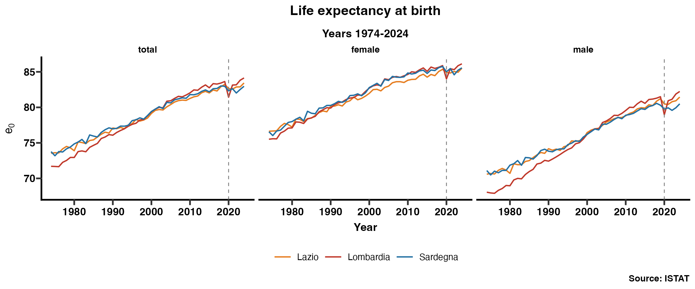
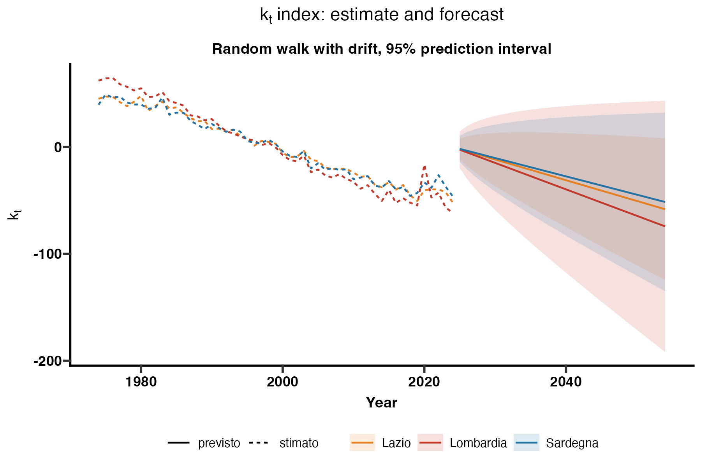
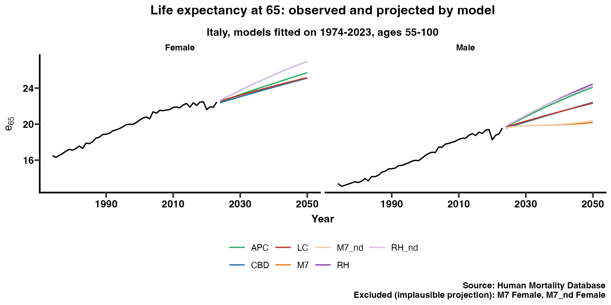

# Longevity in Italy: Lombardy, Lazio and Sardinia (1974–2024)

Mortality analysis and Lee-Carter projection for three Italian regions chosen for their different levels of air pollution (PM10, NO₂):

- **Lombardy**: high pollution and population density
- **Lazio**: intermediate case with a large urban area
- **Sardinia**: low pollution benchmark



## Key results

| | Lombardy | Lazio | Sardinia |
|---|---|---|---|
| Life expectancy at birth, 1974 | 71.7 | 73.5 | 73.8 |
| Life expectancy at birth, 2024 | 84.1 | 83.4 | 83.0 |
| COVID-19 shock, 2019 → 2020 | **−2.2 years** | −0.6 years | −0.6 years |
| 2024 vs 2019 | +0.5 years | +0.2 years | +0.0 years |
| Variance explained by Lee-Carter | 92.3% | 91.0% | 87.1% |
| Projected life expectancy, 2054 | 89.1 | 87.8 | 87.1 |

*Total population, period life expectancy.*

- Lombardy started with the **lowest** life expectancy of the three regions in 1974 and had the **highest** by 2024. The more polluted region shows the fastest long-term improvement, which suggests that air quality cannot be isolated without controlling for other regional factors (income, health care).
- The 2020 shock was almost **four times larger in Lombardy** than in Lazio and Sardinia (−2.5 years for males). By 2024 all three regions were back above their pre-pandemic level.
- Lee-Carter fits Lombardy and Lazio well (around 91–92% of variance explained). The fit is weaker for Sardinia, especially for females (77%), because a smaller population produces noisier rates.



## Phase 2: choosing a stochastic mortality model (Italy, ages 55–100)

Five models fitted with `StMoMo` on Human Mortality Database data for Italy (deaths and exposures, 1974–2023), by sex, and compared out of sample on two backtest windows (fit to 2004 → forecast 2005–2014; fit to 2009 → forecast 2010–2019).

| Model | Average rank in backtest (F / M) | Average error on log q (F / M) | Error on e65 at the end of the window |
|---|---|---|---|
| **Lee-Carter** | **1 / 1** | **0.067 / 0.053** | +0.5 / −0.2 years |
| APC | 2 / 4.5 | 0.108 / 0.088 | +0.7 / +0.6 years |
| CBD | 4 / 4.5 | 0.217 / 0.091 | +0.4 / −0.2 years |
| Renshaw-Haberman | 4 / 6 | 0.206 / 0.587 | +2.4 / from +4.8 to −9.0 years |
| M7 | 6 / 2 | 0.238 / 0.057 | −1.3 / −0.5 years |

- **The best model in sample is not the best forecaster.** Renshaw-Haberman has the lowest BIC for both sexes but the least stable forecasts: for males its error on life expectancy at 65 goes from +4.8 years in one window to −9.0 in the other. Projecting the cohort effect without drift does not fix it.
- **Lee-Carter ranks first in both windows and for both sexes** (forecast error on death probabilities of 4–6%), even though its residuals show an unexplained cohort effect. It is adopted as the reference model, with **APC as a sensitivity**: APC projects higher longevity, which is the prudent direction for annuity pricing.
- **M7 is excluded**: its female projection is implausible (life expectancy at 65 falling to about 6 years by 2050) and its male projection is almost flat, despite good 10-year backtests.
- **COVID years matter**: fitting on 1974–2023 instead of 1974–2019 lowers projected life expectancy at 65 in 2050 by 0.4–0.7 years (Lee-Carter, APC, CBD).



## What the project does

1. Builds age-specific mortality rates and complete life tables from ISTAT data, for total population, females and males.
2. Computes period life expectancy at birth and at age 65, and measures the COVID-19 shock (2019 → 2020) and the recovery.
3. Fits a Lee-Carter model, checks the residuals (age × year heatmaps) and projects the mortality index *k_t* 30 years ahead with a random walk with drift.

## Repository structure

```
data/raw/                 ISTAT regional life tables, one CSV per year
data/hmd/                 HMD Italy deaths and exposures (not included, see Data)
Progetto_demografia.R     phase 1: ISTAT life tables → Lee-Carter by region
Fase2_modelli_stocastici.R  phase 2: model comparison and backtesting (StMoMo)
output/                   phase 1 tables and figures
output/fase2/             phase 2 tables and figures
```

## How to run

Open the project in RStudio from the `.Rproj` file and run `Progetto_demografia.R` (phase 1) or `Fase2_modelli_stocastici.R` (phase 2). Missing packages (`demography`, `StMoMo`, `tidyverse`, `ggprism`) are installed automatically.

## Data

- **Phase 1:** ISTAT regional life tables, 1974–2024 (`datiregionalicompleti<year>-2.csv`). Ages 100 and over are grouped into an open-ended 100+ class.
- **Phase 2:** Human Mortality Database, Italy, period `Deaths_1x1.txt` and `Exposures_1x1.txt`. HMD data are not redistributed here: download them from [mortality.org](https://www.mortality.org) (free registration) and save them in `data/hmd/`.

  *HMD. Human Mortality Database. Max Planck Institute for Demographic Research (Germany), University of California, Berkeley (USA), and French Institute for Demographic Studies (France). Available at www.mortality.org (data downloaded in October 2026).*

## Roadmap

- [x] Compare stochastic mortality models (LC, RH, APC, CBD, M7) with out-of-sample backtesting (`StMoMo`), Italy
- [ ] Apply the selected models to the three regions (ISTAT deaths and population, 2002–2024)
- [ ] Include air quality (PM10, PM2.5, NO₂) as a covariate in a Poisson GLM, at the provincial level
- [ ] Price life annuities with projected cohort tables, by region and sex
- [ ] Simulate longevity risk and compare the resulting capital with the Solvency II standard-formula shock

*Author: Federico Cerri, MSc in Statistical, Financial and Actuarial Sciences, University of Bologna*
